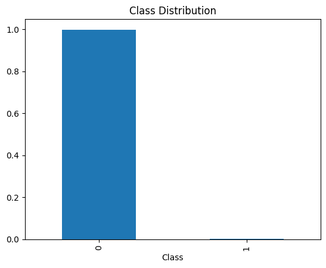
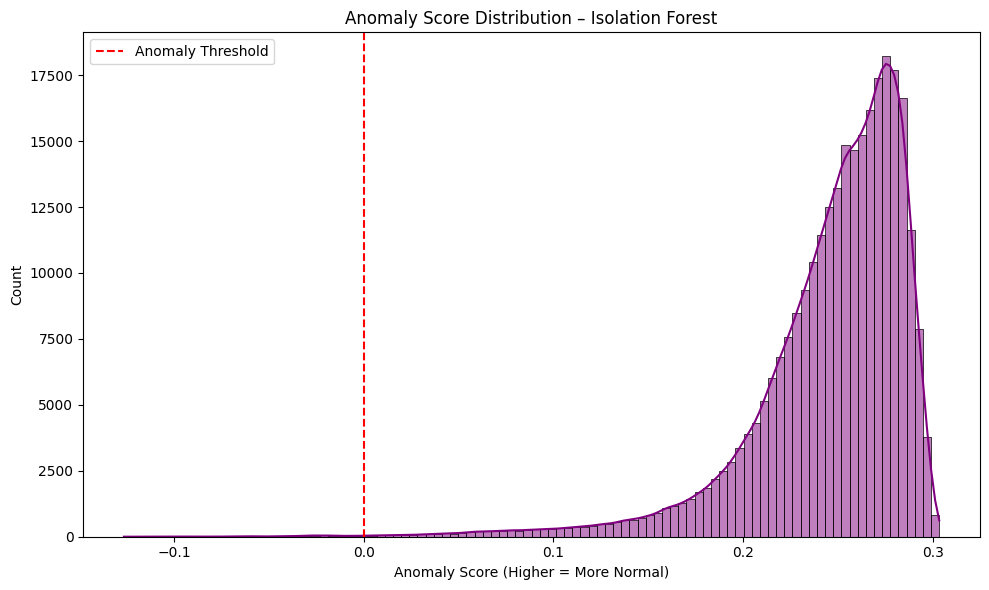

# 🛡️ Credit Card Fraud Detection with Isolation Forest

This project applies unsupervised anomaly detection using an Isolation Forest model to identify fraudulent credit card transactions.

---

## 📊 Dataset

- Source: [Kaggle – Credit Card Fraud Detection](https://www.kaggle.com/datasets/mlg-ulb/creditcardfraud)
- 284,807 transactions
- Only 492 fraud cases (0.17%) – highly imbalanced!
- Features are PCA-transformed

---

## 🧠 Goal

Detect fraud *without using labels* by identifying anomalies in transaction patterns.

---

## 🧪 Model

- Algorithm: **Isolation Forest**
- Strategy: Trained unsupervised on all data (excluding the label)
- Thresholding based on anomaly scores

---

## 📈 Results

| Metric              | Value         |
|---------------------|---------------|
| Accuracy            | 99.74% ✅      |
| Precision (fraud)   | 25.8% ⚠️      |
| Recall (fraud)      | 25.4% ⚠️      |
| F1-score (fraud)    | 25.6% ⚠️      |

---

## 📉 Visualizations

### Confusion Matrix  

### Anomaly Score Distribution  

---

## 📁 Files

- `fraud_detection_isolation_forest.ipynb` – main notebook
- `requirements.txt` – environment info
- Images for GitHub/Notion

---

## ✅ Summary

- Built a fully unsupervised fraud detection model
- Identified 125 true frauds with no labels used in training
- Learned how to use Isolation Forest, score anomalies, and evaluate against rare ground truth

---

## 🚀 Future Ideas

- Try One-Class SVM or Autoencoders
- Test on real-time streaming data
- Deploy as an anomaly scoring API

---

